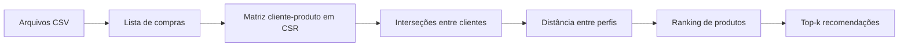

# Sistema de Recomendação para Varejo

Sistema de filtragem colaborativa baseada em usuários que transforma históricos de compra em recomendações personalizadas de produtos. O núcleo do projeto é implementado em C++, utiliza matrizes esparsas no formato CSR e também pode ser consumido por Python por meio de bindings com `pybind11`.

O projeto foi desenvolvido na disciplina de **Programação Estruturada** do curso de Ciência de Dados e Inteligência Artificial da UFPB, no período 2026.1. Mais do que um recomendador funcional, ele explora decisões importantes de engenharia, como modelagem de dados, cálculo de similaridade, processamento de matrizes esparsas e integração entre linguagens.

## Visão geral

Em uma loja com muitos clientes e produtos, a maior parte da matriz cliente–produto é vazia: cada pessoa compra apenas uma pequena parcela do catálogo. Este projeto aproveita essa característica para representar as compras de forma esparsa e recomendar itens a partir do comportamento de clientes com históricos semelhantes.

O fluxo completo é:



### Principais características

- filtragem colaborativa **baseada em usuários**;
- leitura e indexação de clientes e produtos a partir de arquivos CSV;
- representação binária das compras, sem contar compras repetidas do mesmo produto;
- matrizes esparsas no formato **CSR (Compressed Sparse Row)**;
- cálculo de interseções sem construir explicitamente a matriz transposta;
- seleção das `k` recomendações mais bem ranqueadas;
- aplicação de linha de comando em C++;
- integração Python/C++ com `pybind11`.

## Como o recomendador funciona

### 1. Organização do histórico de compras

O projeto possui dois fluxos de entrada. No executável C++ de demonstração, `main.cpp` usa o módulo `ListaCompras` para ler a base em duas passagens: na primeira, cria índices internos compactos para os códigos de clientes e produtos; na segunda, associa a cada cliente a lista de produtos comprados.

Na integração Python, o arquivo CSV é carregado pelo próprio `leitura_e_execucao.py`. O script monta os vetores, mapas e listas de compras e os envia para `solver.cpp`. O binding apenas converte essas estruturas para uma `ListaCompras` em memória e chama a API C++ de similaridade e recomendação — o C++ não lê o CSV nesse fluxo.

Essa conversão permite trabalhar internamente com inteiros, mantendo mapas para relacionar os índices aos códigos originais da loja e aos nomes dos produtos.

### 2. Matriz esparsa e interseção

As compras são convertidas em uma matriz binária `A`, na qual as linhas representam clientes e as colunas representam produtos. Como a matriz contém predominantemente zeros, apenas os valores não nulos são armazenados por meio dos vetores `values`, `col_index` e `row_ptr` do formato CSR.

A quantidade de produtos em comum entre os clientes é obtida por:

```text
I = A × Aᵀ
```

Na implementação, o produto interno é calculado diretamente entre as linhas esparsas de `A`, usando seus índices de coluna ordenados. Assim, não é necessário materializar `Aᵀ`.

### 3. Distância entre clientes

Para dois clientes `i` e `j`, o projeto utiliza uma distância assimétrica baseada na sobreposição dos históricos:

```text
d(i, j) = 1 - |Pᵢ ∩ Pⱼ| / |Pᵢ|
```

onde `Pᵢ` e `Pⱼ` são os conjuntos de produtos comprados por cada cliente. Quanto menor o valor, mais próximo `j` está do perfil de `i`:

- `0`: todos os produtos de `i` também aparecem no histórico de `j`;
- `1`: os clientes não possuem produtos em comum.

A medida é propositalmente assimétrica, pois o denominador considera apenas o histórico do cliente-alvo. Dessa forma, um cliente com muitas compras não é automaticamente tratado como igualmente semelhante a todos os demais.

### 4. Ranking das recomendações

Cada produto começa com pontuação `1`. Para cada vizinho que comprou um item ainda não comprado pelo cliente-alvo, a pontuação desse item é multiplicada pela distância entre os dois clientes. Ao final, os produtos são ordenados em ordem crescente: pontuações menores representam recomendações mais fortes.

## Tecnologias

| Tecnologia | Papel no projeto |
| --- | --- |
| C++ | Implementação dos módulos e do algoritmo de recomendação |
| STL | Vetores, listas, mapas e ordenação |
| CSR | Armazenamento das matrizes esparsas |
| GNU Make | Compilação do executável C++ |
| Python | Interface interativa alternativa |
| pybind11 | Exposição do núcleo C++ como módulo Python |

## Base de dados

O diretório [`data/`](data/) contém 21 arquivos, correspondentes aos clusters de `0` a `20`. Cada linha representa um registro de compra com o seguinte esquema:

| Campo | Descrição |
| --- | --- |
| `DATA_COMPRA` | Data da compra no formato `AAAAMMDD` |
| `COD_CLIENTE` | Código original do cliente |
| `COD_PRODUTO` | Código original do produto |
| `NOME_PRODUTO` | Descrição do produto |

Na versão atual do repositório, o conjunto completo possui:

| Métrica | Quantidade |
| --- | ---: |
| Arquivos CSV | 21 |
| Registros de compra | 101.250 |
| Clientes únicos | 63.741 |
| Produtos únicos | 413 |

## Estrutura do projeto

```text
.
├── data/                  # Bases de vendas separadas por cluster
├── docs/                  # Especificação do projeto e material sobre CSR
├── include/               # Interfaces dos módulos C++
│   ├── lista_compras.h
│   ├── recomendacao.h
│   └── similaridade.h
├── integracao/            # Binding e interface Python
│   ├── leitura_e_execucao.py
│   ├── requirements.txt
│   ├── setup.py
│   └── solver.cpp
├── src/                   # Implementação e programa principal em C++
│   ├── lista_compras.cpp
│   ├── main.cpp
│   ├── recomendacao.cpp
│   └── similaridade.cpp
├── Makefile
└── README.md
```

## Como executar

### Aplicação demonstrativa em C++

Pré-requisitos:

- compilador C++ com suporte a C++11, como `g++`;
- GNU Make.

Clone o repositório, compile e execute:

```bash
git clone https://github.com/JoaoArnaud/SistemaDeRecomendacao-PE-2026.1.git
cd SistemaDeRecomendacao-PE-2026.1
make
make run
```

O executável será gerado em `build/programa`. Ele funciona como um programa de teste da API C++ completa: carrega os dados com `ListaCompras`, constrói a similaridade e solicita as recomendações. A configuração atual usa o arquivo `data/dados_venda_cluster_17.csv`, recomenda cinco produtos para o primeiro cliente carregado e exibe o tempo de execução.

Para experimentar outro cluster, cliente ou valor de `k`, altere os parâmetros no arquivo [`src/main.cpp`](src/main.cpp) e compile novamente. Para remover os artefatos de compilação:

```bash
make clean
```

### Integração com Python

Nesse fluxo, o Python é responsável por ler e organizar os dados. As estruturas prontas são entregues ao módulo `solver`, enquanto o C++ permanece responsável pelo processamento de similaridade em CSR, pelo ranking e pela recomendação.

Pré-requisitos adicionais:

- Python 3;
- compilador C++ com suporte a C++17;
- dependências listadas em `integracao/requirements.txt`.

Com um ambiente virtual Python já ativado, execute:

```bash
cd integracao
python3 -m pip install -r requirements.txt
python3 setup.py build_ext --inplace
python3 leitura_e_execucao.py
```

No Windows, substitua `python3` por `python` se esse for o comando disponível. A compilação gera o módulo nativo `solver` (`.so` no Linux ou `.pyd` no Windows), que é importado pelo script Python.

A interface solicita:

1. a quantidade de recomendações;
2. o código de três clientes presentes no `cluster_17`;
3. em seguida, exibe o histórico e as recomendações de cada cliente.

Alguns códigos válidos para uma execução rápida são `19689801`, `33653401` e `YZ0TYR01`.

## Módulos

| Módulo | Responsabilidade |
| --- | --- |
| `ListaCompras` | Representar os históricos e carregar o CSV no executável C++ de demonstração |
| `SimilaridadeCSR` | Construir as matrizes CSR, calcular interseções e consultar distâncias |
| `Recomendacao` | Identificar vizinhos, calcular o ranking e retornar o top-k |
| `leitura_e_execucao.py` | Carregar e organizar os dados no fluxo Python |
| `solver` | Converter as estruturas recebidas do Python e expor a API C++ de recomendação |

## Escopo atual

O repositório é um projeto acadêmico executado localmente e voltado ao estudo dos fundamentos de sistemas de recomendação e estruturas esparsas. Atualmente, os parâmetros da aplicação C++ são definidos no código-fonte e a interface Python opera sobre um cluster predefinido. Uma evolução natural seria adicionar argumentos de linha de comando, testes automatizados, avaliação da qualidade das recomendações e estratégias de indexação para bases ainda maiores.

## Documentação

- [Especificação do Sistema de Recomendação](docs/Projeto_Sistema_de_Recomendao.pdf)
- [Material de apoio sobre multiplicação CSR](docs/Material_CSR_AAt.pdf)

## Autores

| Nome | GitHub |
| --- | --- |
| João André de Medeiros Arnaud | [@JoaoArnaud](https://github.com/JoaoArnaud) |
| Eduardo Antônio Leitão do Oliveira Lima e Moura Filho | [@EduardoLeitaoFilho](https://github.com/EduardoLeitaoFilho) |
